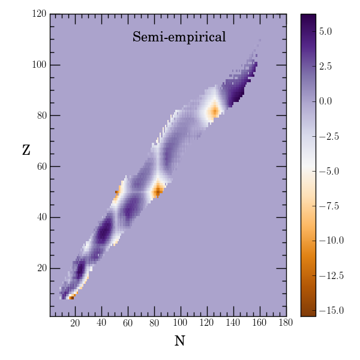
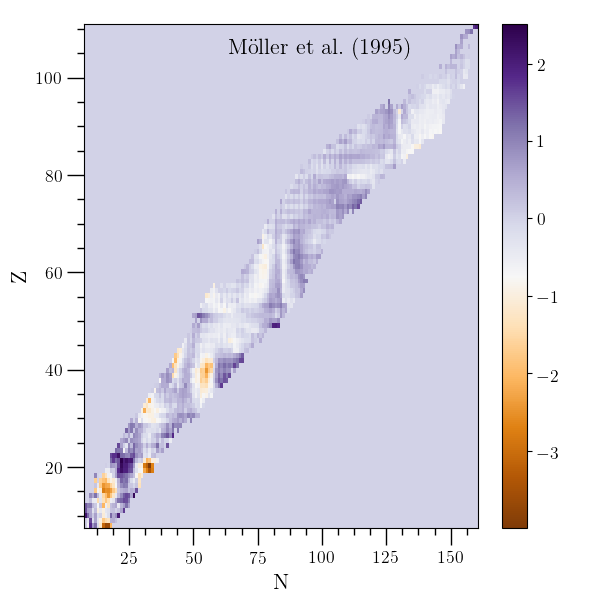
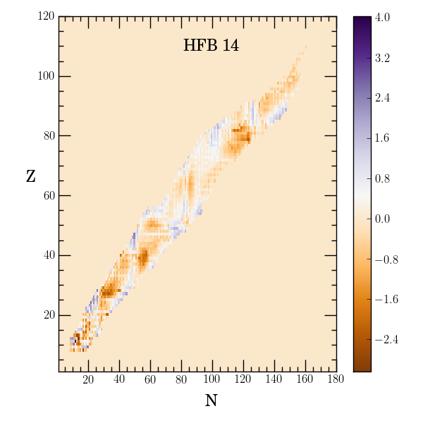
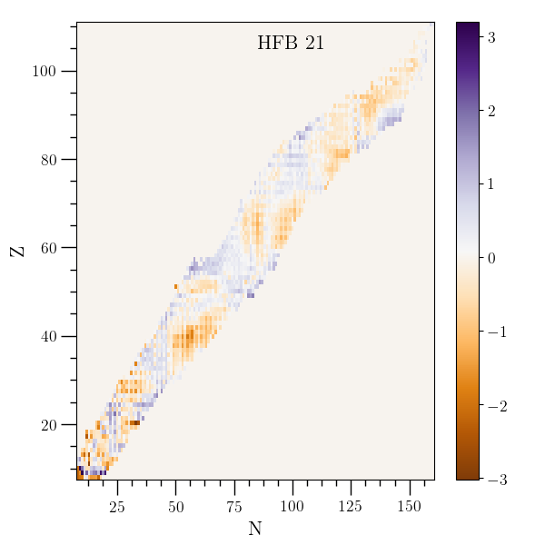
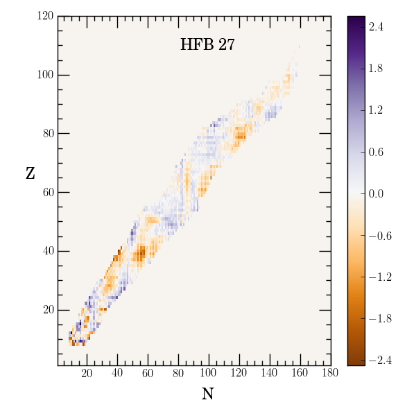
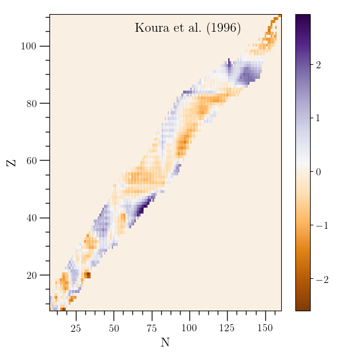
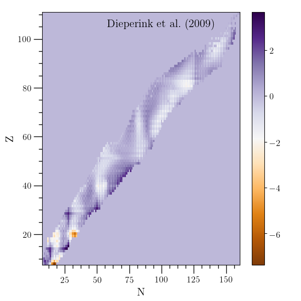
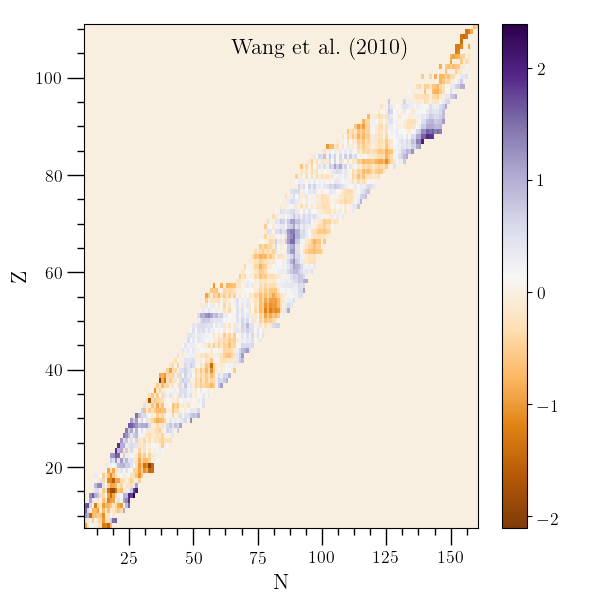
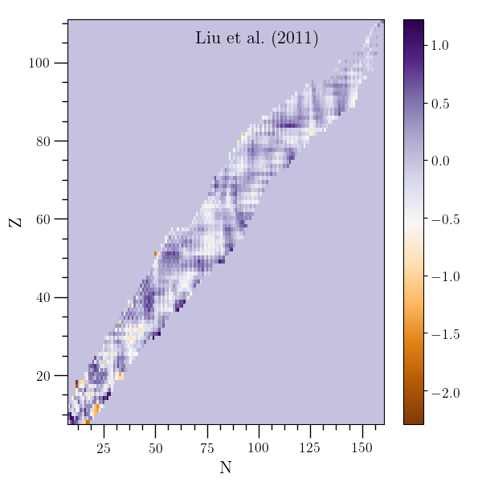

Nuclei and Nuclear Masses
=========================

:ref:`O2scl_part <o2sclp>`

A basic data structure for nuclei, class :cpp:class:`o2scl::nucleus`, is
implemented as a child of :cpp:class:`o2scl::part_tl`.

Nuclear masses are given as children of :cpp:class:`o2scl::nucmass`
and are generally of two types: tables of masses (children of
:cpp:class:`o2scl::nucmass_table`) or formulas which generate masses
from a set of parameters and can be fit to data
(:cpp:class:`o2scl::nucmass_fit`).

There are ten mass table types currently included.

- :cpp:class:`o2scl::nucmass_ame`: data from \ref
  [Audi95]_, [Audi03]_, [Audi12]_ and [Wang12]_, [Huang17]_ and
  [Wang17]_, or [Huang21ta]_ and [Wang21ta]_.
- :cpp:class:`o2scl::nucmass_mnmsk` and
  :cpp:class:`o2scl::nucmass_mnmsk_exp`: masses
  from [Moller95]_, [Moller97]_, and [Moller16ng]_.
- :cpp:class:`o2scl::nucmass_hfb` and
  :cpp:class:`o2scl::nucmass_hfb_sp`: masses from [Goriely02]_,
  [Samyn04]_, or [Goriely07]_.
- :cpp:class:`o2scl::nucmass_dz_table` : masses
  from [Duflo95]_
- :cpp:class:`o2scl::nucmass_ktuy` : masses from
  [Koura00]_ and [Koura05]_
- :cpp:class:`o2scl::nucmass_wlw` : masses from [Wang10]_, [Wang10b]_,
  [Liu11]_, [Wang11]_, or [Wang14]_.
- :cpp:class:`o2scl::nucmass_sdnp` : masses from [Stoitsov03]_ or
  [Dobaczewski04]_.
- :cpp:class:`o2scl::nucmass_dglg` : masses from [Delaroche10]_.

The mass formulas which can be fit to data are

- :cpp:class:`o2scl::nucmass_semi_empirical`: simple 5
  parameter semi-empirical method
- :cpp:class:`o2scl::nucmass_frdm` : macroscopic part of FRDM from
  [Moller95]_
- :cpp:class:`o2scl::nucmass_dz_fit` and
  :cpp:class:`o2scl::nucmass_dz_fit_33` : 10- and 33-parameter mass
  formulas from [Duflo95]_.
- :cpp:class:`o2scl::nucmass_dvi` : 10-parameter formula from
  [Dieperink09]_ with :cpp:class:`o2scl::nucmass_ibm_shell` for shell
  effects
    
In order to create a set of nuclei stored in a ``std::vector``
object, one can use :cpp:func:`o2scl_part::nucdist_set()`.

Nuclear mass fit example
------------------------
    
.. literalinclude:: ../../../../examples/ex_nucmass_fit.cpp
   :language: c++		    
   :start-after: sphinx-example-start

Nuclear mass example
--------------------

.. literalinclude:: ../../../../examples/ex_nucmass.cpp
   :language: c++		    
   :start-after: sphinx-example-start

		

		   
.. |dz96| image:: ../../../../examples/plot/ex_nucmass_dz96.png
		  
.. |ame03| image:: ../../../../examples/plot/ex_nucmass_ame03.png
		   

		   

		   

		   

		    

		 

		  

+---------+---------+---------+----------+
| |se|    | |mnmsk| | |dz96|  | |ame03|  | 
+---------+---------+---------+----------+
| |hfb14| | |hfb21| | |hfb27| | |ktuy05| | 
+---------+---------+---------+----------+
| |dvi|   | |ws32|  | |ws36|  |          | 
+---------+---------+---------+----------+
