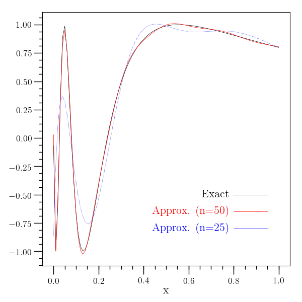

Chebyshev Approximation
=======================

:ref:`O2scl <o2scl>`

Chebyshev Approximation Contents
--------------------------------

- :ref:`Chebyshev approximation introduction`
- :ref:`Chebyshev approximation example`
     
Chebyshev approximation introduction
------------------------------------

A class implementing the Chebyshev approximations based on GSL is
given in :ref:`cheb_approx_tl <cheb_approx_tl>`. This class has its own copy
constructor, so that Chebyshev approximations can be copied and
passed as arguments to functions. Derivatives and integrals of
:ref:`cheb_approx_tl <cheb_approx_tl>` objects are created as new \ref
o2scl::cheb_approx_tl objects which can be easily manipulated.

Chebyshev approximation example
-------------------------------

This example performs an approximation of the function
:math:`y=\sin\left[ 1/\left(x+0.08 \right) \right]` over :math:`[0,2
\pi]`. This function oscillates strongly over this interval and
requires a high order approximation to be accurate.

The image below shows the approximation for :math:`n=50`
:math:`n=25`. The :math:`n=100` would be nearly 
indistinguishable from the exact result on this scale.

.. literalinclude:: ../../../examples/ex_chebapp.cpp
   :language: c++		    
   :start-after: sphinx-example-start
