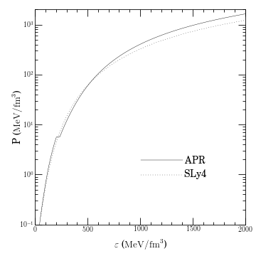
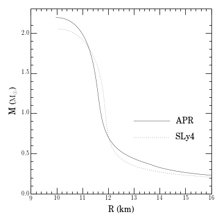
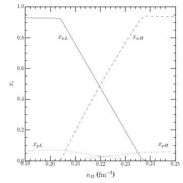

Equations of State of Hadronic Matter
=====================================

:ref:`O2scl <o2scl>`
     
The hadronic equations of state (EOSs) treat nucleonic (neutrons
and protons) matter at zero or finite temperature. There are
models which are easily written in terms of the neutron and proton
densities:

- :ref:`eos_had_schematic <eos_had_schematic>`,
- :ref:`eos_had_skyrme <eos_had_skyrme>`,
- :ref:`eos_had_apr <eos_had_apr>`,
- :ref:`eos_had_gogny <eos_had_gogny>`,
- :ref:`eos_had_potential <eos_had_potential>`, and
- :ref:`eos_had_tabulated <eos_had_tabulated>`,

and those which are more easily written in terms of the neutron
and proton chemical potentials:
  
- :ref:`eos_had_rmf <eos_had_rmf>`, 
- :ref:`eos_had_rmf_delta <eos_had_rmf_delta>`, 
- :ref:`eos_had_ddc <eos_had_ddc>`, and
- :ref:`eos_had_virial <eos_had_virial>`.

All of these EOSs are built on the base class :ref:`eos_had_base
<eos_had_base>`, which includes several methods which apply to all of
these models. For example, methods which calculate the saturation
properties of nuclear matter. These methods are sometimes overloaded
in descendants when exact formulas are available.

There is also a set of classes to modify the quartic term of the
symmetry energy: :ref:`eos_had_sym4_rmf <eos_had_sym4_rmf>`,
:ref:`eos_had_sym4_apr <eos_had_sym4_apr>`, :ref:`eos_had_sym4_skyrme
<eos_had_sym4_skyrme>`, and :ref:`eos_had_sym4_mdi <eos_had_sym4_mdi>`
all based on :ref:`eos_had_sym4_base <eos_had_sym4_base>` which can be
used in :ref:`eos_had_sym4 <eos_had_sym4>`.

Akmal-Pandharipande-Ravenhall EOS example
-----------------------------------------
    
This example computes the APR EOS with :ref:`eos_had_apr
<eos_had_apr>`. It computes nuclear and neutron matter and then matter
in beta-equilibrium with both a Maxwell construction (as done in the
[Akmal98eo]_) and a Gibbs construction to match the low- and
high-density phases. Afterwards it computes the properties of neutron
stars from the EOS. Most of the data is stored in :ref:`table_units
<table_units>` objects and then written to HDF files in the
examples directory.

This example is rather lengthy and the full source code is not
duplicated here. The class created in that example is documented at
:ref:`ex_eos_had_apr <ex_eos_had_apr>` . The EOS and mass radius
curves for APR created by this example and for the Skyrme model SLy4
from the next example is below. The third figure below is the Gibbs
phase transition for APR.

	   

	   

Typical output:

.. literalinclude:: ../../../examples/ex_eos_had_apr.scr
   :language: none		    

Skyrme EOS example
------------------
    
This example computes the EOS and neutron star 
properties using :ref:`eos_had_skyrme <eos_had_skyrme>` from a Skyrme model.

This example is rather lengthy and the full source code is not
duplicated here. The class created in that example is documented at
:ref:`ex_eos_had_skyrme <ex_eos_had_skyrme>` .

Typical output:

.. literalinclude:: ../../../examples/ex_eos_had_skyrme.scr      
   :language: none

