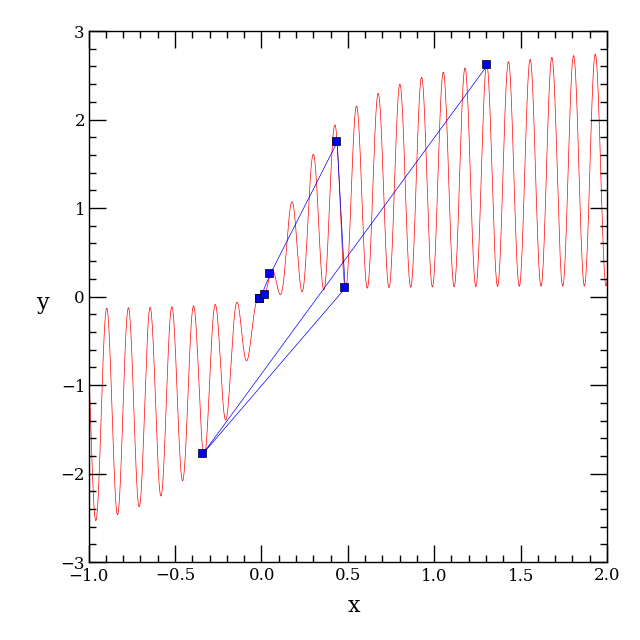
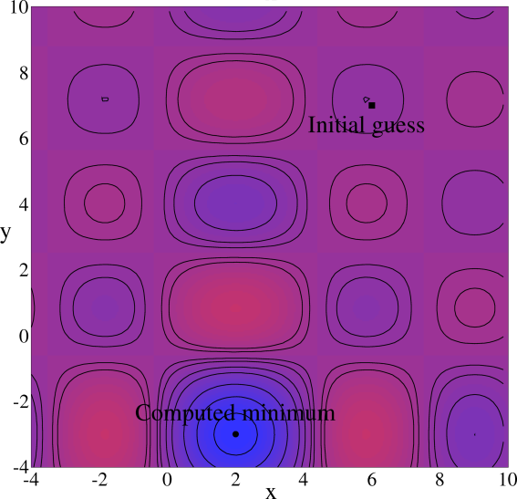
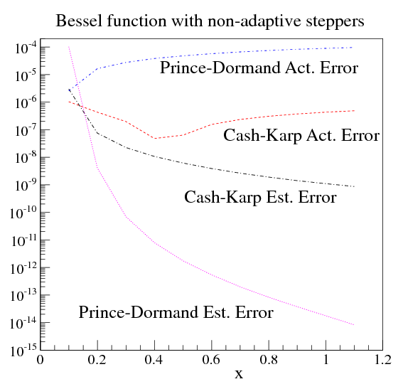
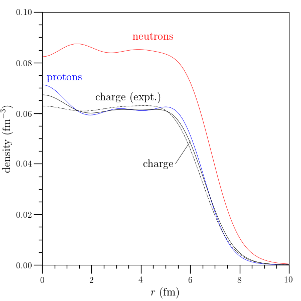
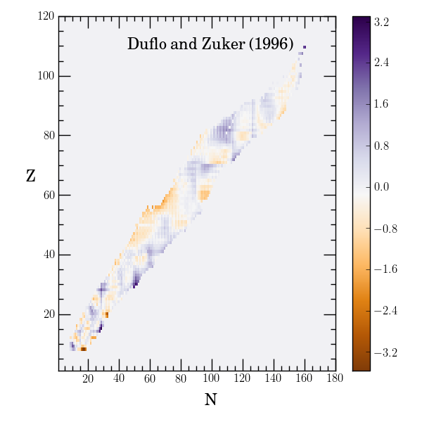

.. _o2scl:

Object-oriented Scientific Computing Library: v0.930a1
======================================================

O₂scl is a C++ library for object-oriented scientific computing which
has been in active development for 20 years. This is a beta version.
Some O₂scl classes state-of-the-art and others are more experimental.
O₂scl continues to evolve. Release versions should install and test
successfully, and most of the classes are ready for production use.
Some of the interfaces may change slightly in future versions.
Additionally, O₂scl computes the thermodynamics of particles and
nuclei, constructs equations of state of dense matter, and solves
equations related to neutron star structure.

Gallery
=======

		  

		    

		 

		     

.. csv-table::

   Root finding,Minimization,ODEs,Nuclear Structure,Nuclear masses
   |fptr|,|anneal|,|ode|,|nucprof|,|nucmass|

User's Guide
============
   
.. toctree::
   :maxdepth: 1

   download
   install
   usage
   vecmat
   interp
   const
   funct
   table
   string
   diff
   inte
   poly
   solve
   min
   mcarlo
   mcmc
   anneal
   hist
   ode
   linalg
   algebraic
   cheb
   unitconv
   multip
   specfunc
   conmin
   fit
   multi_interp
   hdf
   acol
   python
   para
   other
   lset
   part
   fermion
   nuclei
   hadrons
   eos_quarks
   eos_beta
   eos_tov
   tov_solve
   eos_momi
   eos_tidal
   eos_cnstar
   eos_rot
   eos_bps
   nucleus_rmf
   sneos
   part_multip
   yanic
   design
   dev_guide
   license
   related
   ack
   ref
   class_list
   function_list
   todos

* :ref:`genindex`
* :ref:`search`

