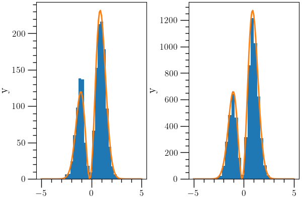

Probability Distributions and Markov Chain Monte Carlo
======================================================

:ref:`O2scl <o2scl>`

MCMC Contents
-------------

- :ref:`Probability distributions`
- :ref:`Markov chain Monte Carlo (MCMC)`
- :ref:`MCMC example`

Probability distributions
-------------------------

Probability distributions are provided by the C++ standard library,
but some useful functionality is not included and multidimensional and
conditional distributions are not provided. For the time being, some
experimental probability distributions are included in O₂scl.

The one-dimensional probability distributions are children of
:ref:`prob_dens_func <prob_dens_func>` and are modeled similar to the
C++ standard distributions:

- :ref:`prob_dens_gaussian <prob_dens_gaussian>`
- :ref:`prob_dens_lognormal <prob_dens_lognormal>`
- :ref:`prob_dens_uniform <prob_dens_uniform>`
- :ref:`prob_dens_hist <prob_dens_hist>`

Multi-dimensional distributions are children of :ref:`prob_dens_mdim
<prob_dens_mdim>`, including

- :ref:`prob_dens_mdim_factor <prob_dens_mdim_factor>`
- :ref:`prob_dens_mdim_gaussian <prob_dens_mdim_gaussian>`
- :ref:`prob_dens_mdim_biv_gaussian <prob_dens_mdim_biv_gaussian>`
- :ref:`prob_dens_mdim_amr <prob_dens_mdim_amr>`
- :ref:`prob_dens_mdim_gmm <prob_dens_mdim_gmm>`
- :ref:`kde_python <kde_python>`

Conditional probability distributions are children of 
:ref:`prob_cond_mdim <prob_cond_mdim>`. These classes can be used
as proposal distributions for the O₂scl MCMC classes.

- :ref:`prob_cond_mdim_gaussian <prob_cond_mdim_gaussian>`
- :ref:`prob_cond_mdim_fixed_step <prob_cond_mdim_fixed_step>`
- :ref:`prob_cond_mdim_indep <prob_cond_mdim_indep>`

Markov chain Monte Carlo (MCMC)
-------------------------------

The class :ref:`mcmc_para_base <mcmc_para_base>` performs generic MCMC
simulations and the child class :ref:`mcmc_para_table
<mcmc_para_table>` performs MCMC simulations and stores the results in
a :ref:`table_units <table_units>` object. These classes contain
support for OpenMP and MPI (or both). The class :ref:`mcmc_para_cli
<mcmc_para_cli>` is a specialized class which automatically handles
the command-line interface when using MCMC.

MCMC example
------------

The first example shows an MCMC of a bimodal distribution, 

.. math::

  f(x) = \exp ( -x^2) \left[ \sin \left( x-7/5 \right) + 1 \right]
  
with a naive random walk step. It uses that MCMC to compute
the value

.. math::

   \left< x^2 \right> = \left( \int_{-5}^{5} x^2 f(x) \right)
   \left( \int_{-5}^{5} f(x) \right)^{-1}

and compares that value with the exact result obtained by quadrature.    

.. literalinclude:: ../../../examples/ex_mcmc.cpp
   :language: c++		    
   :start-after: sphinx-example-start

The image plots the posterior distribution from this first MCMC as
well as a second MCMC using a proposal distribution generated from a
kernel density estimation (from the :ref:`kde_python <kde_python>`
class) of the data generated from the first MCMC. This simulation is
about five times more efficient, and thus gives a more accurate result
for the integral.
                 

Below is the code for the second MCMC, which uses O₂scl C++ interface
to SciPy's KDE algorithm.
         
.. literalinclude:: ../../../examples/ex_mcmc_kde.cpp
   :language: c++		    
   :start-after: sphinx-example-start

         
                 
