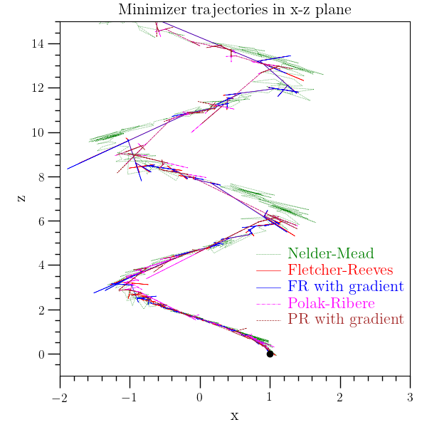

Minimization
============

:ref:`O2scl <o2scl>`

One-dimensional minimizers
--------------------------

One-dimensional minimization is performed by descendants of
:ref:`min_base <min_base>` . There are four one-dimensional
minimization algorithms, :ref:`min_cern <min_cern>`,
:ref:`min_brent_gsl <min_brent_gsl>`, :ref:`min_brent_boost
<min_brent_boost>`, and :ref:`min_quad_golden <min_quad_golden>`. All
four are bracketing algorithms type where an interval and an initial
guess must be provided. If only an initial guess and no bracket is
given, these two classes will attempt to find a suitable bracket from
the initial guess. While the :ref:`min_base <min_base>` base class is
designed to allow future descendants to optionally use derivative
information, this is not yet supported for any one-dimensional
minimizers.

Multi-dimensional minimizers
----------------------------

Multi-dimensional minimization is performed by descendants of
:ref:`mmin_base <mmin_base>` . \o2 includes a simplex minimizer (
:ref:`mmin_simp2 <mmin_simp2>`), traditional minimizers which use
gradient information (:ref:`mmin_conp <mmin_conp>`, :ref:`mmin_conf
<mmin_conf>`, and :ref:`mmin_bfgs2 <mmin_bfgs2>`), and differential
evolution minimizers :ref:`diff_evo <diff_evo>` and
:ref:`diff_evo_adapt <diff_evo_adapt>`). Minimization by simulated
annealing is included and described in the :ref:`Simulated Annealing`
section. Constrained minimization is also included and described in
separately in :ref:`Constrained Minimization`.

See an example for the usage of the multi-dimensional minimizers
in the :ref:`Multidimensional minimizer example` below. 

Simplex minimizer
-----------------
    
The class :ref:`mmin_simp2 <mmin_simp2>` minimizes a function using
the Nelder-Mead simplex algorithm and does not require any information
about the gradient. It is based on GSL.

Restarts of the simplex minimizer are sometimes required to find the
correct minimum, and :ref:`mmin_simp2 <mmin_simp2>` can get caught in
infinite loops, especially for functions which have symmetries
directly related to one or more of the parameters.

Traditional minimizers with gradient information
------------------------------------------------

Classes :ref:`mmin_conp <mmin_conp>`, :ref:`mmin_conf <mmin_conf>`,
and :ref:`mmin_bfgs2 <mmin_bfgs2>` are intended for use when the
gradient of the function is available, but they can also
automaticallly compute the gradient numerically. The standard way to
provide the gradient is to use an object of type :ref:`grad_funct
<grad_funct>` . The user may specify the automatic gradient object of
type :ref:`gradient <gradient>` which is used by the minimizer to
compute the gradient numerically when a function is not specified.

Generally, when a closed expression is available for the gradient,
:ref:`mmin_bfgs2 <mmin_bfgs2>` is likely the best choice. However, the
simplex methods can be more robust for sufficiently difficult
functions.
    
It is important to note that not all of the minimization routines
test the second derivative to ensure that it doesn't vanish to 
ensure that we have indeed found a true minimum. 

Fixing Parameters
-----------------

The class :ref:`mmin_fix_params <mmin_fix_params>` provides a
convenient way of fixing some of the parameters and minimizing over
others, without requiring a the function interface to be rewritten. An
example is given in the :ref:`Minimizer fixing variables` example
below.

Multidimensional minimizer example
----------------------------------

This example uses the \o2 minimizers based on GSL to minimize a
rather complicated three-dimensional function which has constant
level surfaces which look like springs oriented along the z-axis.
This example function, originally created here for \o2, was added
later to the GSL library minimization test functions. 

.. literalinclude:: ../../../examples/ex_mmin.cpp
   :language: c++		    
   :start-after: sphinx-example-start

	 
.. image:: ../../../examples/plot/ex_mmin_plot2.png
   :width: 60%	   
   :alt: alt text

Minimizer fixing variables
--------------------------

This example uses the :ref:`mmin_fix_params <mmin_fix_params>` class
to minimize the function

.. math::
   
   y=\left(x_0-2\right)^2+\left(x_1-1\right)^2+x_2^2

while fixing some of the parameters.

.. literalinclude:: ../../../examples/ex_mmin_fix.cpp
   :language: c++		    
   :start-after: sphinx-example-start

