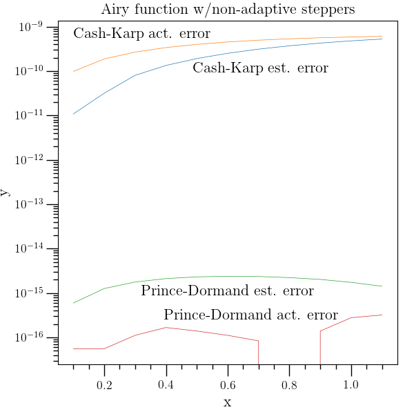
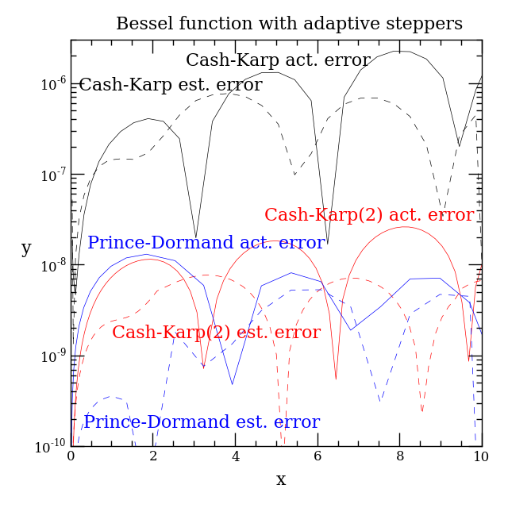
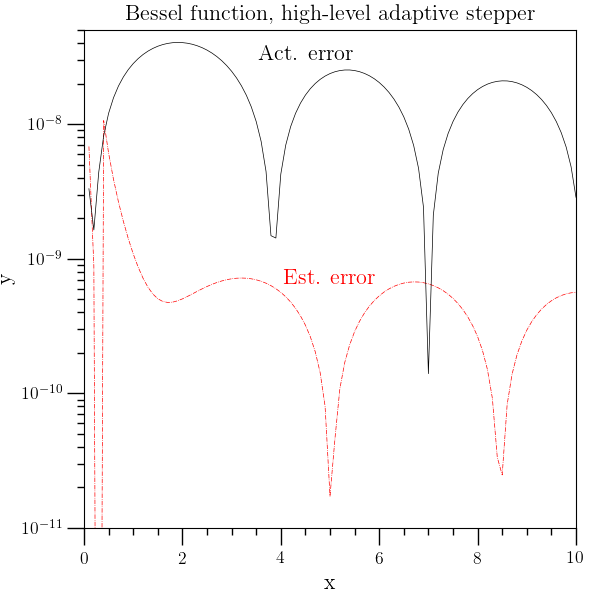
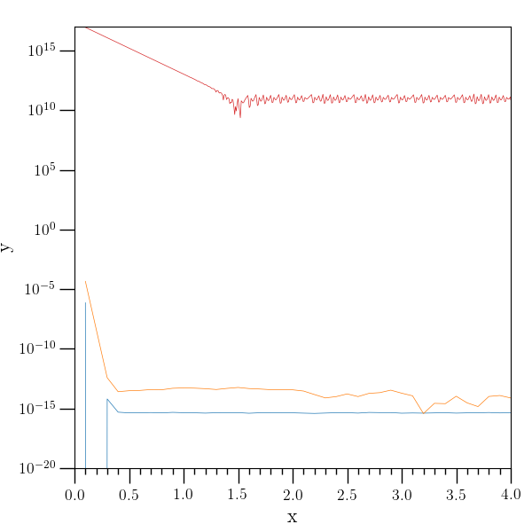

Ordinary Differential Equations
===============================

:ref:`O2scl <o2scl>`

Ordinary Differential Equations Contents
----------------------------------------

- :ref:`Ordinary Differential Equations Introduction`
- :ref:`Ordinary differential equations example`
- :ref:`Ordinary differential equations example source code`
- :ref:`Stiff differential equations example`
- :ref:`Iterative solution of ODEs example`  

Ordinary Differential Equations Introduction
--------------------------------------------

Classes for non-adaptive integration are provided as descendents of
:ref:`ode_step <ode_step>` and classes for adaptive integration are
descendants of :ref:`astep_base <astep_base>`. To specify a set of
functions to these classes, use a child of :ref:`ode_funct
<ode_funct>` for a generic vector type. The classes
:ref:`ode_rkf45_gsl <ode_rkf45_gsl>` and :ref:`ode_rkck_gsl
<ode_rkck_gsl>` are reasonable general-purpose non-adaptive
integrators and :ref:`astep_gsl <astep_gsl>` is a good general-purpose
adaptive method for non-stiff problems. For stiff ODE's, use
:ref:`ode_bsimp_gsl <ode_bsimp_gsl>` (see :ref:`Stiff differential
equations example`).

Solution of simple initial value problems is performed by
:ref:`ode_iv_solve <ode_iv_solve>`. This class uses an adaptive
integrator (default is :ref:`astep_gsl <astep_gsl>`) and does some
bookkeeping to simplify the solution of initial value problems. The
:ref:`ode_iv_solve <ode_iv_solve>` class will give the final value of
the functions at the endpoint, provide the functions on a
user-specified grid, or it will tabulate the ODE solution for you
using the grid chosen with the adaptive stepper. A example
demonstrating the solution of initial value problems is given in the
:ref:`Ordinary differential equations example`.

The solution of boundary-value problems is based on the abstract base
class :ref:`ode_bv_solve <ode_bv_solve>`. At the moment, a simple
shooting method is the only implementation of this base class and is
given in :ref:`ode_bv_shoot <ode_bv_shoot>` . An experimental
multishooting class is given in :ref:`ode_bv_mshoot <ode_bv_mshoot>`.

An application of linear solvers to solve finite-difference equations
approximating a boundary value problem is given in :ref:`ode_it_solve
<ode_it_solve>`. A example demonstrating the iterative solution of a
boundary value problem is given in the :ref:`Iterative solution of
ODEs example`.

Ordinary differential equations example
---------------------------------------

This example solves the differential equations defining the the Bessel
and Airy functions with both the Cash-Karp and Prince-Dormand
steppers. It demonstrates the use of :ref:`ode_rkck_gsl
<ode_rkck_gsl>`, :ref:`ode_rk8pd_gsl <ode_rk8pd_gsl>`, :ref:`astep_gsl
<astep_gsl>`, and :ref:`ode_iv_solve <ode_iv_solve>` and stores the
results in :ref:`table <table>` objects.

The Bessel functions are defined by

.. math::

   y^{\prime\prime} = \frac{1}{x^2} \left[ 
   y \left(\alpha^2 - x^2\right) -x y^{\prime} \right]

The Bessel functions of the first kind, :math:`J_{\alpha}(x)` are 
finite at the origin, and the example solves the :math:`\alpha=1` case,
where :math:`J_1(0) = 0` and :math:`J_1^{\prime}(0) = 1/2`.

.. image:: ../../../examples/plot/ex_ode_bessel.png
   :width: 60%	   
   :alt: alt text

Note that with a Bessel function and a fixed step size, the
Prince-Dormand stepper (even though of higher order than the
Cash-Karp stepper) is actually less accurate, and seriously
underestimates the error.

The Airy functions are defined by

.. math::
   
   y^{\prime\prime} = y x

This example solves for the Airy function of the first kind, 
:math:`Ai(x)`.

Here the higher order stepper is more accurate.

Ordinary differential equations example source code
---------------------------------------------------

.. literalinclude:: ../../../examples/ex_ode.cpp
   :language: c++		    
   :start-after: sphinx-example-start

Stiff differential equations example
------------------------------------

This example solves the differential equations

.. math::

   \begin{eqnarray*}
   y_0^{\prime} &=& 480 y_0 + 980 y_1 \nonumber \\
   y_1^{\prime} &=& -490 y_0 - 990 y_1
   \end{eqnarray}

which have the exact solution

.. math::
   
   \begin{eqnarray}
   y_0 &=& -e^{-500 x} + 2 e^{-10 x} \nonumber \\
   y_1 &=& e^{-500 x} - e^{-10 x}
   \end{eqnarray}

using both the stiff stepper :ref:`ode_bsimp_gsl <ode_bsimp_gsl>` and
the standard adaptive stepper :ref:`astep_gsl <astep_gsl>` . The
relative error on the adaptive stepper is orders of magnitude larger.

.. literalinclude:: ../../../examples/ex_stiff.cpp
   :language: c++		    
   :start-after: sphinx-example-start

Iterative solution of ODEs example
----------------------------------

This example solves the ODEs

.. math::
   
   \begin{eqnarray}
   y_0^{\prime\prime} &=& y_1 \nonumber \\
   y_1^{\prime\prime} &=& y_0+y_1\nonumber \\
   y_2^{\prime\prime} &=& y_0+y_2
   \end{eqnarray}

given the boundary conditions

.. math::

   \begin{eqnarray}
   y_0(x=0)&=&1 \nonumber \\
   y_1(x=0)^2+y_2(x=0)^2&=&2 \nonumber \\
   y_1(x=1) &=& 3
   \end{eqnarray}

by linearizing the ODEs on a mesh and using an iterative method
(sometimes called relaxation). The :ref:`ode_it_solve <ode_it_solve>`
class demonstrates how this works, but is slow for large grid sizes
because the matrix is very sparse.

.. literalinclude:: ../../../examples/ex_ode_it.cpp
   :language: c++		    
   :start-after: sphinx-example-start

