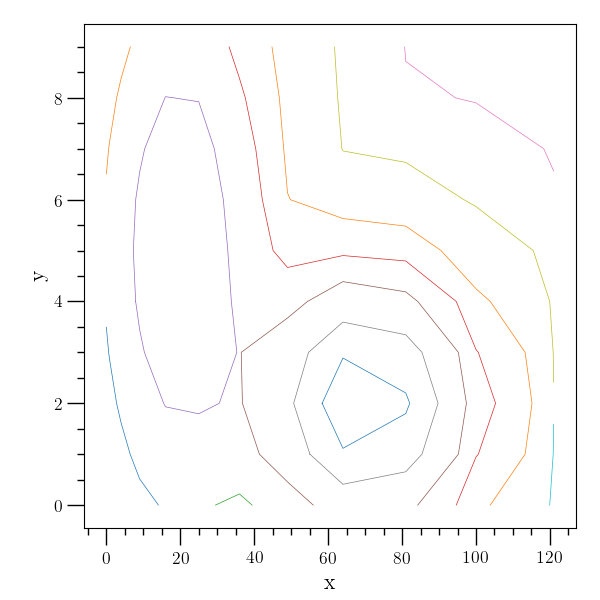
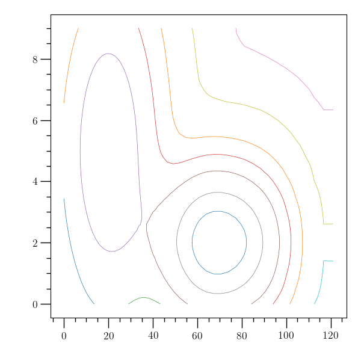

Higher-dimensional Interpolation
================================

:ref:`O2scl <o2scl>`

Higher-dimensional Interpolation Contents
-----------------------------------------
     
- :ref:`Two-dimensional interpolation`
- :ref:`Multi-dimensional interpolation`
- :ref:`Interpolation specializations`  
- :ref:`Interpolation on a rectangular grid`
- :ref:`Contour lines`  

Two-dimensional interpolation
-----------------------------

There are two types of two-dimensional interpolation classes, the
first is based on a function defined on a two-dimensional grid
(though the spacings between grid points need not be equal). The
class :ref:`interp2_direct <interp2_direct>` implements bilinear or bicubic
interpolation, and is based on D. Zaslavsky's routines at
https://github.com/diazona/interp2d (licensed under GPLv3).
A slightly slower (but a bit more flexible) alternative is 
successive use of :ref:`interp_base <interp_base>` objects, implemented
in :ref:`interp2_seq <interp2_seq>` . 

If data is arranged without a grid, then you can either use one of the
multi-dimensional interpolation classes described below or
:ref:`interp2_neigh <interp2_neigh>`, which performs nearest-neighbor
interpolation. At present, :ref:`contour <contour>` lines can only be
computed with data which is defined on a grid.

Multi-dimensional interpolation
-------------------------------

There are three classes for multi-dimensional interpolation of data
(where the independent variables may or may not be defined on a grid).
Multidimensional-dimensional kriging (Gaussian process interpolation)
is performed by :ref:`interpm_krige_optim <interpm_krige_optim>` .
Eigen and Armadillo specifications are also available (see
:ref:`Interpolation specializations`). A C++ interface for
interpolation in Python using several different methods including
Gaussian processes or neural networks from O₂sclpy is provided in
:ref:`interpm_python <interpm_python>` when Python support is enabled.
Finally, inverse distance weighted interpolation is performed by
:ref:`interpm_idw <interpm_idw>`. These interpolation classes are all
built upon :ref:`interpm_base <interpm_base>`.
    
Multi-dimensional interpolation for data defined on a grid is
possible with :ref:`tensor_grid <tensor_grid>`. See the documentation
for :cpp:func:`o2scl::tensor_grid::interpolate()`,
:cpp:func:`o2scl::tensor_grid::interp_linear()` and
:cpp:func:`o2scl::tensor_grid::rearrange_and_copy()`. Also, if you
want to interpolate ``rank-1`` indices to get a vector result, you can
use :cpp:func:`o2scl::tensor_grid::interp_linear_vec()` .

Interpolation specializations
-----------------------------

.. doxygentypedef:: interpm_krige_optim_eigen
                    
.. doxygentypedef:: interpm_krige_optim_arma

Interpolation on a rectangular grid
-----------------------------------

.. literalinclude:: ../../../examples/ex_interp2.cpp
   :language: c++		    
   :start-after: sphinx-example-start

This example creates a sample 3 by 3 grid of data with the 
function :math:`\left[ \sin \left( x/10 + 3 y/10 \right) \right]^2`
and performs some interpolations and compares them with the 
exact result.

.. literalinclude:: ../../../examples/ex_interp2.scr

Contour lines
-------------

This example generates contour lines of the function

.. math::

   z = f(x,y) = 15 \exp \left[ - \frac{1}{20^2}\left( x-20 \right)^2 
   - \frac{1}{5^2}\left(y-5\right)^2\right] + 
   40 \exp \left[ - \frac{1}{500}\left( x-70 \right)^2 
   - \frac{1}{2^2}\left(y-2\right)^2\right]

.. literalinclude:: ../../../examples/ex_contour.cpp
   :language: c++		    
   :start-after: sphinx-example-start

The figure below shows contour lines in the region :math:`x\in(0,121),
y\in(0,9)`. The data grid is represented by plus signs, and the
associated generated contours. The figure clearly shows the peaks at
:math:`(20,5)` and :math:`(70,2)`.

The :ref:`contour <contour>` class can also use interpolation to
attempt to refine the data grid. The new contours after a refinement
of a factor of 5 is given in the figure below.
    

